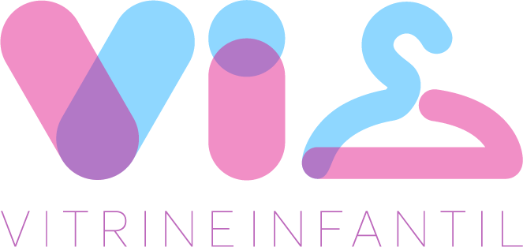

<p align="center">
  <a href="" rel="noopener">
 </a>
</p><a href="" rel="noopener">

<h3 align="center">Vitrine Infantil Dashboard</h3>

<div align="center">

[]()

</div>

---

<p align="center"> Dashboard para administração do servidor, contendo busca e listagem de roupas infantis originadas de E-commerces
    <br> 
</p>

## 📝 Sumário

- [Sobre](#sobre)
- [Pré Requisitos](#prerequisito)
- [Instalando/Iniciando](#instalando)
- [Autores](#autores)

## 📖 Sobre <a name = "sobre"></a>

O projeto tem como objetivo administrar o Vitrine Infantil Server, servidor responsável por buscar e listar produtos cadastrados nas plataformas de E-commerces (Magazord).

## ✔️ Pré Requisitos <a name = "prerequisito"></a>

Ferramentas necessárias para executar o sistema

```
Yarn 1.22.5^
Node 12.0.0^
```

## 👨🏻‍💻 Instalando/Iniciando <a name = "instalando"></a>

Depois de clonar o reposítório e configurar o arquivo .env adequadamente, deve ser rodado o comando para iniciar o sistema:

```
yarn start
```
## ✍️ Autores <a name = "autores"></a>

- [@JeanPoffo](https://github.com/JeanPoffo) - Prototipagem, Desenvolvimento e Deploy
